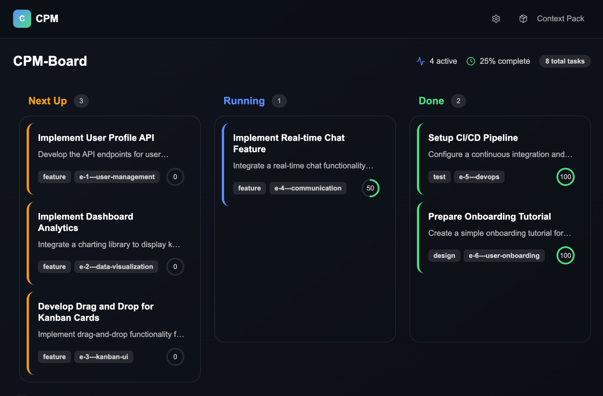

# Cursor Project Master (CPM)



### From idea to app. One PRD, zero code. Cursor builds it. Kanban tracks it.

**The full-stack builder for vibe coders, product thinkers, and AI-native creators — all inside Cursor.**

## Why Cursor Project Master?

Cursor Project Master (CPM) transforms structured documents directly into full-stack, production-ready applications. Built specifically for Cursor users, CPM requires only a single clear Product Requirements Document (PRD) to generate, test, and deploy entire applications automatically.

* 📝 **Just your docs:** Clearly describe your idea—CPM takes care of everything else.
* 📋 **Visual Kanban:** Track tasks automatically from `todo` to `done`.
* 🤖 **Zero hassle:** Fully automated coding, testing, and deployment.
* 🚀 **Instant launch:** Move swiftly from idea to deployed product, iterate effortlessly.

## ⚡ Quick Start

### 1. Install
```bash
npx @project-master-ai/cli init
```

### 2. Write Your Docs

Fill in the templates located in `docs/_templates/`:

* `PRD.md` – Product vision & requirements
* `TECH_SPEC.md` – Technical stack & deployment preferences
* `DATA_MAP.md` – Define your data clearly
* `UX_FLOW.md` – User interactions step-by-step
* `STYLE_GUIDE.md` – Visual and UI elements

**Tip:** Use ChatGPT or Gemini as assistants for clarity (prompt example below):

```bash
Act as a world-class product manager and a principal software architect. Your task is to help me create the initial documentation blueprint for a new software project. You must be rigorous, structured, and ask clarifying questions if my idea is ambiguous.

## CONTEXT
You will be generating the content for a set of specific Markdown templates that an autonomous AI agent will use to build the entire application. The agent requires extreme clarity and structure. It cannot make assumptions.

## MY IDEA
[Your IDEA]

## YOUR TASK
Based on my idea, generate the content for the following files(PRD/TECH SPEC/...). For each file, present the content inside a Markdown code block.

> **Critical Rules**
>
> 1. Do **not** invent, infer, or guess any information. If something is unknown, ask.
> 2. Before drafting **any** document you must:
>    a. Ask every clarifying question needed for 100 % accuracy.
>    b. Wait until I reply **"done"** to signal that no more information will be provided for now.
>    c. Request that I upload the blank template file you're about to fill.
> 3. Work **one file at a time** in the order above. Do not begin the next file until I approve the current one.
> 4. When writing:
>    • Use precise, imperative language (avoid words like "robust," "nice," "etc.").
>    • If a detail is truly undecided, write **"N/A – not decided yet"** instead of leaving it blank or making assumptions.
>    • Output pure Markdown **without code-fences** so I can paste directly into the file.
> 5. After you deliver a draft, explicitly ask: **"Is this acceptable? If yes, reply 'next'; if changes are needed, specify them."**

> **Workflow Overview**
>
> 1. **Discovery Phase** – You ask exhaustive questions covering product idea, personas, constraints, metrics, stack, data, UX, style, compliance, etc.
> 2. I answer until satisfied, then type **"done."**
> 3. You say: *"Please upload `PRD.md` template."*
> 4. I upload the file.
> 5. **Drafting Phase** – You generate the completed `PRD.md` content only.
> 6. I review; if approved, I reply **"next."**
> 7. Repeat steps 3-6 for `TECH_SPEC.md`, then `DATA_MAP.md`, `UX_FLOW.md`, and finally `STYLE_GUIDE.md`.
> 8. After the fifth file is accepted, you conclude with **"All documents completed."**

> **Begin by asking your clarifying questions now.**
```

Place completed docs in `/docs`.

### 3. Let CPM Do Its Magic

Open your project in **Cursor**, activate **Agent Mode**, and type:

```bash
init
```

### 4. Configure Deployment (Optional if you chosoe Vercel)

```bash
npx vercel login
npx vercel link
npx vercel env pull
```

*(Or follow setup steps for your chosen host.)*

### 5. Watch Progress

* Tasks auto-update through stages (`todo`, `in_progress`, `done`).
* Track live updates in `project/project_status.md`.
* Visual Kanban interface under `/kanban` for real-time tracking.
* Auto-deploy preview on every commit; production deployment by merging into `main`.

### 6. Quick Kanban Access

```bash
# Start Kanban board directly (in any CPM project)
npx @project-master-ai/cli kanban

# Or with custom port
npx @project-master-ai/cli kanban --port 3001
```

The Kanban board will automatically open in your browser!

## Adding Features (Under 1 Minute!)

**Edit your PRD:**

```markdown
## New Feature: Image Upload
Allow users to upload images (JPEG/PNG ≤ 5MB). Store on Supabase Storage.
```

Then just inform CPM:

```
Add the "Image Upload" feature from PRD.md.
```

CPM takes care of updating, implementing, testing, and deploying automatically.

## Project Structure

```
.cursor/rules/                 # CPM guidelines
kanban/                        # AI-powered Kanban interface
docs/                          # Product & technical specs
project/
  _templates/                  # Task & epic templates
  tasks/                       # Kanban-style management
  project_status.md            # Real-time updates
scripts/                       # Utilities for reporting
.github/workflows/             # CI/CD automation
src/                           # Auto-generated code
```

## FAQ

| Question                        | Answer                                               |
| ------------------------------- | ---------------------------------------------------- |
| Am I stuck with one tech stack? | No. Edit `TECH_SPEC.md` and CPM adapts seamlessly.   |
| Can I manually edit the code?   | Yes! Your changes become the new baseline instantly. |
| How does CPM store "memory"?    | Clearly in local text files. Nothing hidden.         |
| What if tests fail repeatedly?  | CPM reflects, revises plans, retries intelligently.  |

## Contribute & License

MIT License – Fork, build, innovate!

**Contributions welcome!** PRs are encouraged—let's build together.