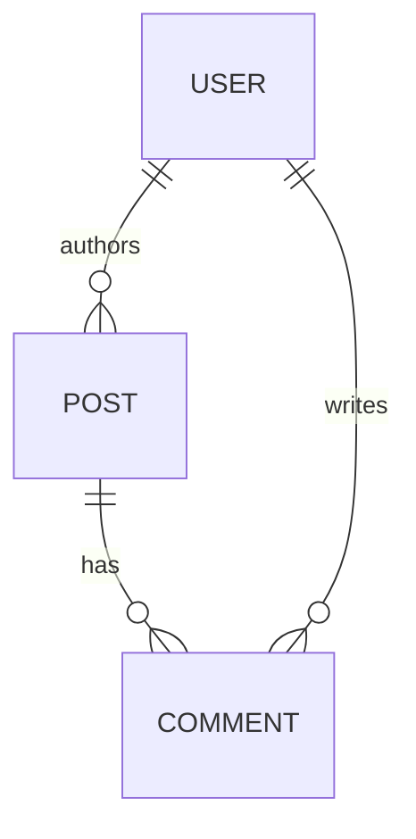

# Data Map and Relationships

## Overview
This document provides a high-level overview of the relationships between the core data entities. The definitive schema is maintained in `TECH_SPEC.md` as a Zod schema, which is the single source of truth.

## Entity-Relationship Diagram

## Relationships
`User 1-N Post`, `Post 1-N Comment`, …

- **User to Post:** One-to-Many (`A User can have many Posts. A Post has one User.`)
- **Post to Comment:** One-to-Many (`A Post can have many Comments.`)
- **User to Comment:** One-to-Many (`A User can write many Comments.`)

## Business Rules
Validation, cascading deletes, etc.

- When a `User` is deleted, all their associated `Posts` and `Comments` must also be deleted (cascading delete).
- A `Post` cannot be created without a valid `authorId` linking to an existing `User`.