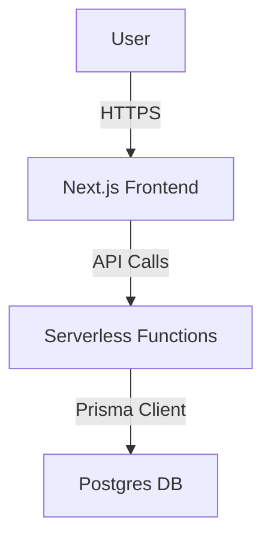

# Technical Specification

## 1. System Architecture
Provide a high-level diagram (e.g., using Mermaid syntax) and a brief description of the overall system architecture, showing how the main components interact.



## 2. Stack Selection
The agent will use these keys to select scaffolding tools and libraries.
```yaml
frontendStack: nextjs-14      # options: react-native, vue3, astro
backendStack: nextjs-api-routes # options: express, nestjs
database: supabase-postgres    # options: mongo, sqlite, dynamodb
deploymentTarget: vercel       # options: render, aws-amplify, heroku
```

## 3. Data Models
The single source of truth for data structures. This must be written as a Zod schema. The agent will infer TypeScript types and generate Prisma schema from this.

```typescript
// src/lib/schema.ts
import { z } from 'zod';

export const User = z.object({
  id: z.string().uuid().describe("Primary Key"),
  email: z.string().email(),
  role: z.enum(['ADMIN','MEMBER']).default('MEMBER'),
  createdAt: z.date().default(() => new Date()),
});

export const Post = z.object({
  id: z.string().uuid(),
  authorId: z.string().uuid(),
  title: z.string().min(3).max(255),
  content: z.string(),
});
```

## 4. Component Breakdown
| Component | Responsibility | Public API |
|-----------|----------------|-----------|

## 5. API Contract (OpenAPI/REST)
Define the primary API endpoints, including methods, paths, request payloads, and response structures.

- **`POST /api/users`**
  - **Description:** Creates a new user.
  - **Request Body:** `{ email, password }`
  - **Response:** `201 Created` with `User` object (excluding password).

- **`GET /api/posts`**
  - **Description:** Retrieves a list of posts.
  - **Response:** `200 OK` with `Post[]`.

## 6. Deployment and Operations
Stages, env vars, secrets sourcing.

- **Environment Variables:** List required secrets (e.g., `SUPABASE_URL`, `VERCEL_TOKEN`).
- **Build Process:** The standard process is `npm ci && npm run lint && npm test && npm run build`.
- **CI/CD:** The process is defined in `.github/workflows/ci.yml`.

## 7. Open Questions
List any technical decisions or requirements that are still unclear and require further clarification.