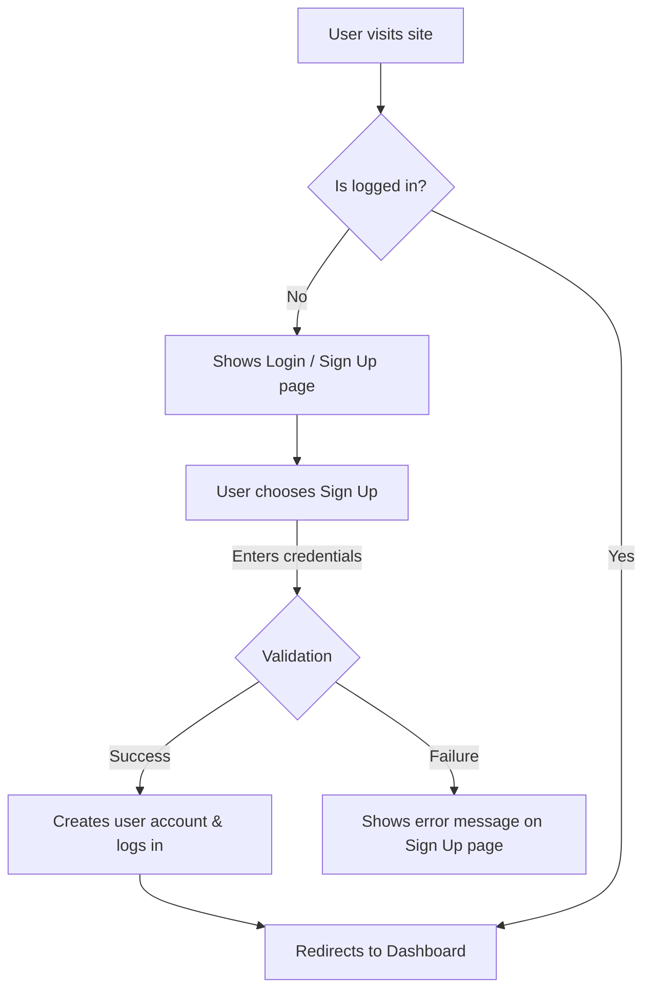

# User Experience Flows

## 1. User Authentication Flow

| Flow | Persona | Happy Path Steps | Edge Cases / Alternate Paths |
|---|---|---|---|
| **Sign Up** | New Visitor | 1. Clicks "Sign Up". 2. Fills valid email/password. 3. Clicks "Submit". 4. Is redirected to Dashboard. | - Email already exists. - Password is too weak. - Network error on submission. |
| **Login** | Returning User | 1. Clicks "Login". 2. Enters correct credentials. 3. Is redirected to Dashboard. | - Incorrect password. - User not found. - Account is locked. |